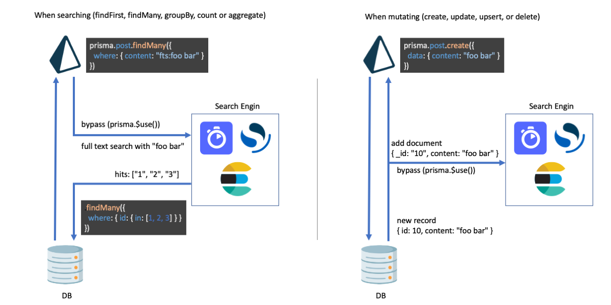

# @prisma-fts

This library performs Prisma full-text search with external tools such as ElasticSearch, OpenSearch, and Algolia.

## Libraries

### For Algolia

See [`@prisma-fts/algolia`](https://github.com/aiji42/prisma-fts-middleware/tree/main/packages/algolia)

### For Elasticsearch

See [`@prisma-fts/elasticsearch`](https://github.com/aiji42/prisma-fts-middleware/tree/main/packages/elasticsearch)

### For OpenSearch

See [`@prisma-fts/opensearch`](https://github.com/aiji42/prisma-fts-middleware/tree/main/packages/opensearch)

### For Meilisearch

If there is a need, I will make it, just let me know in an issue.

## Structure

Bypass the query to the search engine using [Prisma middleware](https://www.prisma.io/docs/concepts/components/prisma-client/middleware).

## Contributing
Please read [CONTRIBUTING.md](./CONTRIBUTING.md) for details on our code of conduct, and the process for submitting pull requests to us.

## License
This project is licensed under the MIT License - see the [LICENSE](./LICENSE) file for details
